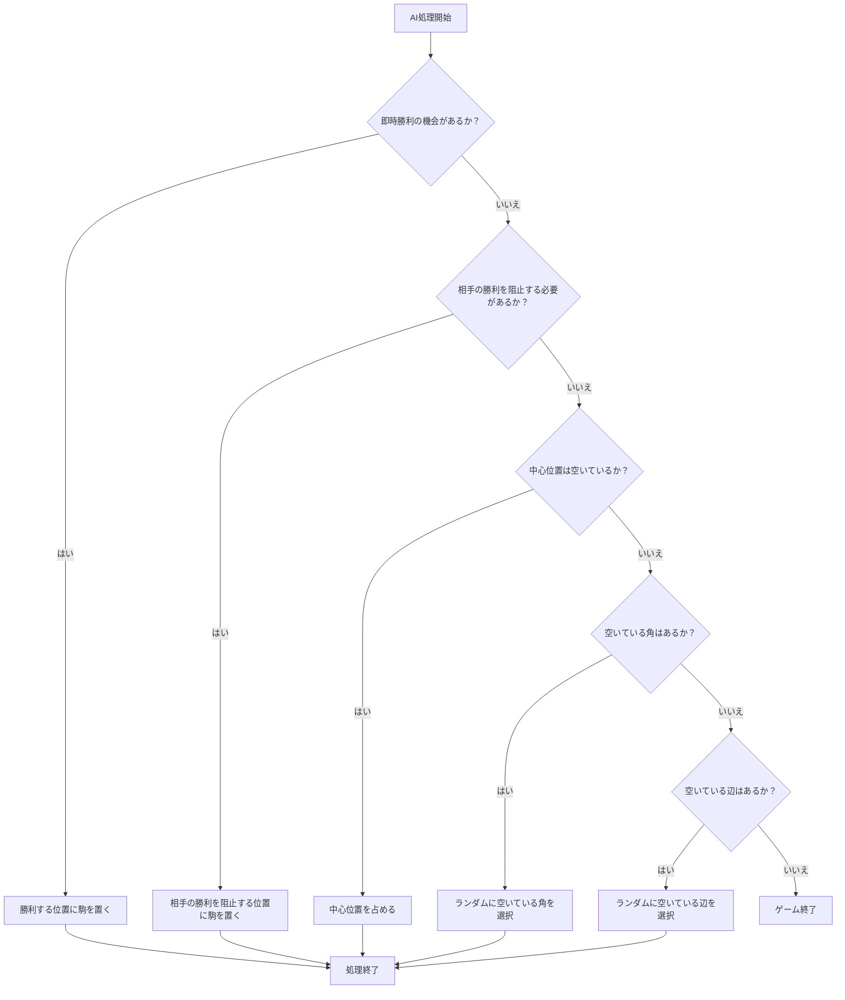

```mermaid  
graph TB  
    A[AI処理開始] --> B{即時勝利の機会があるか？}
    B -->|はい| C[勝利する位置に駒を置く]
    B -->|いいえ| D{相手の勝利を阻止する必要があるか？}
    D -->|はい| E[相手の勝利を阻止する位置に駒を置く]
    D -->|いいえ| F{中心位置は空いているか？}
    F -->|はい| G[中心位置を占める]
    F -->|いいえ| H{空いている角はあるか？}
    H -->|はい| I[ランダムに空いている角を選択]
    H -->|いいえ| J{空いている辺はあるか？}
    J -->|はい| K[ランダムに空いている辺を選択]
    J -->|いいえ| L[ゲーム終了]
    C --> M[処理終了]
    E --> M
    G --> M
    I --> M
    K --> M
```